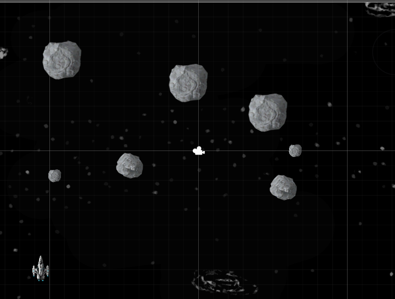
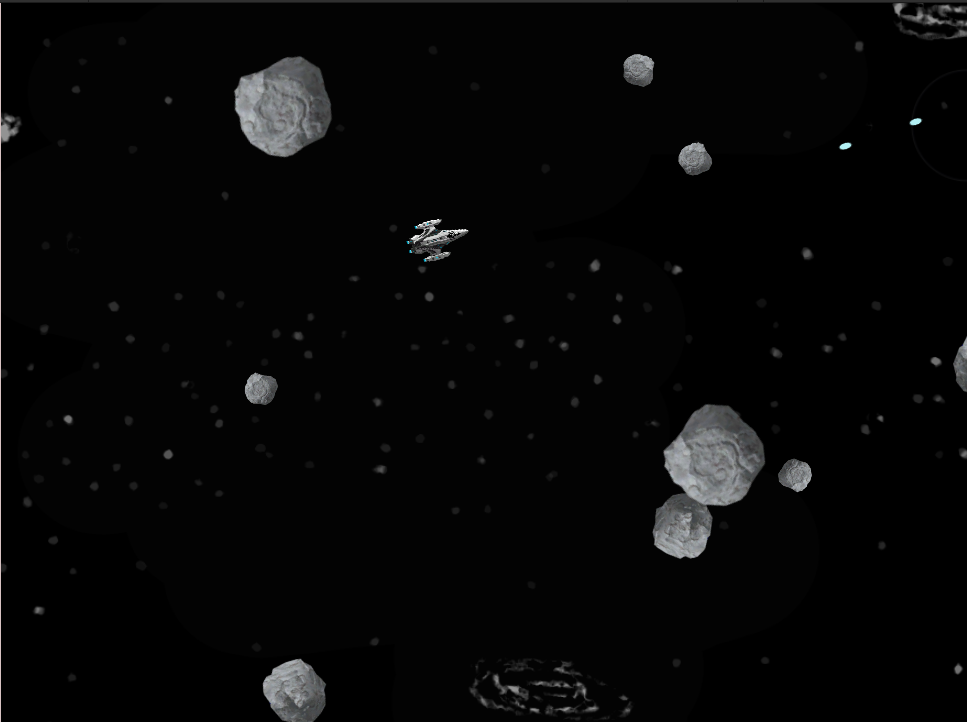

Here is old game "Asteroids" in Unity3D. It can be called finished, but there are always things to upgrade. 

  Originally I made it using Unity3D 2021.3.1f1, but it works with later versions also.
 There are 3 sizes of asteroids. Asteroids are split into 2 smaller if it possible, 
otherwise - disappear. Spawn some more of them.
  The ship cannot die after hitting by asteroid, but impact of hitting is implemented.
  W, A, S, D - control space ship, "Space" to shoot.

 
 

